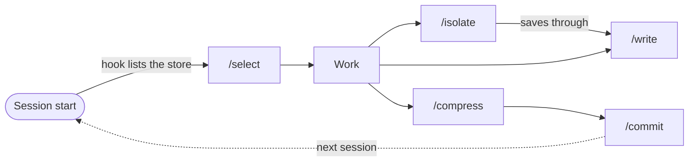

<div align="center">

# WISCI

**Context engineering for AI coding agents, with notes that check themselves against your code.**

[](.claude-plugin/plugin.json)
[](../../LICENSE)
[](https://github.com/ph3on1x/agent-plugins-skills/commits/main/plugins/wisci)
<br>
[](https://code.claude.com/docs/en/plugins)
[](https://agentskills.io)
[](https://docs.astral.sh/uv/)

[Quick start](#quick-start) · [Commands](#commands) · [How it works](#how-it-works) · [Scenarios](#scenarios) · [What's new in 3.0](#whats-new-in-30)

</div>

Long sessions get worse as the context window fills with noise. WISCI keeps what matters on disk as plain Markdown, quotes the code behind every claim, and checks those quotes each time a note loads. When the code moves on, the note says so instead of quietly misleading your agent.

- **Write** what you learned as a note whose claims quote the code they rest on.
- **Isolate** research in subagents, so only the synthesis enters your session.
- **Select** only what the task needs, with every section whose quoted code changed flagged.
- **Compress** work into per-stream handoffs for the next session or a teammate.
- **`/commit`** records which agent-context files changed, as git trailers.

## Quick start

In Claude Code (2.1.275 or newer):

```text
/plugin marketplace add ph3on1x/agent-plugins-skills
/plugin install wisci@ph3on1x
```

Then, in any project:

```text
/isolate how does auth work in this repo     # research in subagents, findings saved as a note
/select auth                                 # next session: load it back, flagged where the code changed
/compress                                    # stopping? hand the work off
```

> [!IMPORTANT]
> WISCI needs **git** and **[uv](https://docs.astral.sh/uv/getting-started/installation/) 0.12+**. uv provides Python 3.11+ and downloads it on first use. Without uv, skills stop with `uv: command not found`, and the plugin prints an install hint at session start. `/commit` needs git 2.32+ for `git commit --trailer`. Verified on Claude Code 2.1.296.

<details>
<summary><b>Codex, Cursor, Gemini CLI, Antigravity, Copilot</b></summary>

<br>

```bash
npx skills add ph3on1x/agent-plugins-skills --skill commit compress isolate select write
```

- **No hooks.** The session-start summary and compaction guidance ship only in the Claude Code plugin.
- **No command injection.** The model reads the skill and runs `scripts/wisci.py` through uv itself.
- **Name collisions.** `npx skills` doesn't namespace skills, so `commit` or `write` can collide with another skill of the same name. The Claude Code plugin namespaces them as `/wisci:<name>`.
- **Implicit invocation.** Codex, Gemini CLI, Antigravity and Copilot pick skills implicitly by default. `commit` ships `agents/openai.yaml` to turn that off on Codex.

</details>

## Commands

| You're thinking | Run | What happens |
|---|---|---|
| "I'll need this tomorrow" | `/write auth-research` | Saves findings to `.wisci/context/auth-research.md`, each claim about code with the lines it rests on quoted |
| "Research this without cluttering my session" | `/isolate compare OAuth2 libraries for Node.js` | Subagents research in their own context windows; you get one synthesis, and durable findings are saved as a note |
| "Where was I?" | `/select` | A short orientation from the repo's own docs, your handoff streams, and an inventory of notes with their evidence status |
| "I need my auth research back" | `/select auth-research` | Loads the note and flags every section whose quoted code is no longer in the code |
| "Done for the day" | `/compress` | Writes each work stream to its own handoff: goal, progress, next steps, ruled-out approaches, your constraints |
| "Time to commit" | `/commit` | A conventional commit with one `AI-Context:` trailer per changed agent-context file |

## Why

Context fails in four recognizable ways ([Drew Breunig](https://www.dbreunig.com/2025/06/22/how-contexts-fail-and-how-to-fix-them.html)), and each has a WISCI answer:

| Failure | What goes wrong | WISCI's answer |
|---|---|---|
| **Poisoning** | A wrong fact persists and compounds | `/write` quotes the code each claim rests on; `/select` flags sections whose quote is gone |
| **Distraction** | Accumulated history crowds out the task | `/isolate` keeps research in separate windows; `/compress` lets you restart lean |
| **Confusion** | Irrelevant material steers the model wrong | `/select` loads only the notes the task needs |
| **Clash** | Facts gathered across turns contradict each other | `/write` merges section by section, and a newer decision retires the older one |

Model performance drops as input grows, often unevenly ([Chroma, *Context Rot*](https://research.trychroma.com/context-rot)). There is no universal threshold; keeping utilization around 40–60% is a practitioner heuristic ([HumanLayer](https://github.com/humanlayer/advanced-context-engineering-for-coding-agents/blob/main/ace-fca.md)), not a measured limit.

> [!TIP]
> Claude Code compacts automatically near the context limit. Run `/compress` before that happens, or set `CLAUDE_AUTOCOMPACT_PCT_OVERRIDE` to compact earlier.

## How it works



### The store

```text
.wisci/
├── context/<topic>.md      # knowledge notes: /write
└── handoff/<stream>.md     # per-stream work state: /compress
```

Commit `.wisci/` to share notes through git, or gitignore it to keep them local; the evidence check works the same either way. The dotfolder keeps a casual file search from pulling notes in, by convention rather than guarantee.

### Quoted evidence, checked on every load

A claim about what the code does carries the lines it rests on, in a fenced block tagged with the language and the file's path:

````markdown
## Session
Sessions expire after 3600 seconds.

```ts src/auth/session.ts
export const SESSION_TTL = 3600 // seconds
```
````

When that line changes, the section still loads, under a marker naming the file and the missing code:

```text
## Session
> check — `src/auth/session.ts` no longer contains `export const SESSION_TTL = 3600 // seconds`. Re-read it before relying on this section.
Sessions expire after 3600 seconds.
```

- **The match.** The quoted lines must occur exactly once in the file, as whole lines with the same relative indentation. Trailing whitespace and line endings don't matter, so code that moved within the file still matches. A changed value, lines stitched from two places, or a line that now occurs twice does not.
- **States.** A section whose quotes all match is `ok`, one with a failing quote is `check`, and one without quotes (a decision, a plan, a requirement) has neither.
- **Writing quotes.** Writers quote 1–3 lines: the line that would change if the claim became false (the value, the condition, the call), not just a signature. `/write` and `/compress` end with `wisci.py check`, so a mistyped quote fails at once. Decisions carry their date, and a newer one on the same topic moves the older one to Ruled out.
- **Fixing wrong notes.** When the code contradicts a loaded section, flagged or not, `/select` names it, states the current fact and suggests `/write <note>` (`/compress` for a handoff); it never edits the store itself. `/isolate` saves the correction through `/write`, even after a quick lookup.
- **Nothing hidden, nothing stored.** Every section loads, and a flag clears as soon as the quoted code matches again. There are no verification records and no "mark as verified" step: the note carries its own evidence. Skills load notes through `wisci.py load`, never a raw Read, which would drop the markers.
- **Why quotes, not whole files.** Only 13–20% of code changes trigger comment updates ([Wen et al., ICPC'19](https://www.inf.usi.ch/faculty/lanza/PUBS/P/Wen2019a.pdf)), so flagging every change to a cited file is mostly noise. On three real repositories a quoted line survived 91–95% of the changes to its file. Swimm (in CI) and GitHub Copilot Memory (at read time) also check cited code, not whole files.

> [!NOTE]
> `ok` means the quoted code is still there, not that every claim is true. A behavior change that leaves the quoted lines intact, in a caller, in configuration, or a claim that something is absent, isn't flagged. Critical behavior belongs in tests.

<details>
<summary><b>Failure reasons</b></summary>

<br>

`no longer contains <line>` · `contains the quoted code N times` · `does not exist` · `is outside the project` · `is not a source file` · `is not a text file` · `is too large to check` · `has an empty quote` · `a code fence is not closed`

New store files are reserved atomically, so parallel sessions never overwrite each other's new notes or streams. When two sessions update the same stream, the last write wins.

</details>

<details>
<summary><b>Script reference</b></summary>

<br>

`scripts/wisci.py` is a [PEP 723](https://packaging.python.org/en/latest/specifications/inline-script-metadata/) script with no dependencies, Python 3.11+ standard library only. Every caller runs it the same way, from the project root:

```bash
uv run --no-config --no-cache --script scripts/wisci.py <command>
```

- `--script` keeps your project's dependencies out of it.
- `--no-config` ignores uv config files, the project's and your own. This matters for `npx skills` installs, which copy the script into your project. `UV_*` environment variables still apply.
- `--no-cache` keeps it working in sandboxes that block writes to `~/.cache`, such as Claude Code's Bash sandbox.

| Command | Does |
|---|---|
| `scan` | Compact JSON: `[path, failed, quotes]` for every store file, plus handoff streams |
| `load <file>` | The whole note, failing sections under a `check` marker |
| `check <file>` | Only the failing quotes, then `evidence ok N/M` |
| `new <context\|handoff> <slug>` | Reserve a new store file |
| `session-status` | The session-start summary |
| `test` | Self-tests |

`<file>` is a store path (`.wisci/context/auth.md`) or the short name `scan` prints (`context/auth`).

</details>

<details>
<summary><b>Hooks (Claude Code)</b></summary>

<br>

- **Session start** lists stored notes and streams with their evidence status, and tells the agent to load them with `/select`, not a raw Read, which would skip the check.
- **After compaction**, it reminds you to `/compress` any in-progress stream.
- **Before compaction**, it asks the summarizer to keep paths, decisions, ruled-out approaches and your constraints verbatim. This is best-effort: Claude Code passed the hook's output to the summarizer when checked (2.1.294), but the docs don't promise it. Running `/compress` before compaction is the reliable path.

</details>

### Git as long-term memory

`/commit` adds one `AI-Context:` trailer per agent-context file it commits (`.wisci/`, `CLAUDE.md`, `AGENTS.md`, Cursor, Copilot, Codex and Gemini rules, plugin skills and hooks), so `git log` shows how your agent context evolved:

```bash
git log --format='%h %(trailers:key=AI-Context,valueonly,separator=%x3B )'
```

## Scenarios

**A feature across sessions**

```text
> /select auth-layer               # stored notes (changed parts flagged) + code + git history
> /isolate compare JWT vs session-based auth for our use case
> /compress                        # writes .wisci/handoff/auth-refactor.md

  — next day —
  (session start lists: "handoff/auth-refactor — active, 2/2 quotes ok …")
> /select auth-refactor
  … implement …
> /commit feat: add token refresh to auth middleware
```

**Parallel streams**

```text
> /compress     # Monday, auth work: writes .wisci/handoff/auth-refactor.md
> /compress     # Tuesday, another session, CI work: writes .wisci/handoff/ci-runners.md
> /select ci-runners
```

**A teammate's notes after the code moved on**

```text
> /select
  context/payment-integration — 1/2 quotes failing
> /select payment-integration
  (Webhook Flow loads under "> check — `src/payments/webhook.ts` no longer contains `return evt.type` …")
  Webhook Flow is out of date: events now go through `dispatch(evt.type)`.
  Run /write .wisci/context/payment-integration.md to fix it.
> /write payment-integration       # re-reads the handler, corrects the section and its quote
```

## What's new in 3.0

- **Quoted evidence** replaces `## References` manifests and whole-file change tracking. A flag now means the quoted code is gone, and it names the missing line.
- **Flag, don't strip.** Every section loads; a failing one sits under a `check` marker instead of disappearing.
- **Self-healing notes.** `/select` points out the fix for a wrong note, and `/isolate` saves it.
- **Stateless and lighter.** No primer, no generated handoff index, no `index` command. One stdlib script, run through uv.
- **Gated on three models.** Every release runs trigger, task and outcome evals on Sonnet, Opus and Haiku, and must pass the release gate.

> [!WARNING]
> **Upgrading from 2.x:** there is no migration. Install uv first. 2.x notes load as written, with no quotes, until you next `/write` them. 3.0 doesn't use `.wisci/primer.md` or `.wisci/handoff.md`, so you can delete both.

## Development

<details>
<summary><b>Self-tests, linters and the release gate</b></summary>

<br>

Run these from `plugins/wisci`. Every eval step uses your Claude Code login; check `claude auth status` first.

```bash
uv run --no-config --no-cache --script scripts/wisci.py test
npx pyright --pythonversion 3.11 scripts/wisci.py
uvx ruff check --target-version py311 scripts evals
```

`evals/` holds three suites:

- **Trigger cases** (tag `trigger`) check that each skill fires on its requests and stays silent on near-misses.
- **Task cases** (tag `task`) check behavior in a scaffolded repo with `claude plugin eval`.
- **`evals/outcomes.py`** checks what native graders can't express: git trailers under different attribution settings, byte-identical untouched files, notes healed after a real session, a missing uv, the Bash sandbox, a hostile project uv config, and zero permission prompts.

The release gate runs all three suites on Sonnet, Opus and Haiku into one matrix directory, then `evals/gates.py` checks completeness and thresholds. Trigger recall (at least 80%, at most one false fire per skill) gates Sonnet and Opus; Haiku's is recorded, because Haiku often answers small requests itself, as the skills allow. Safety outcomes gate every model, and so does the safety task case `select-flags-changed`, which must pass every run:

```bash
export DISABLE_AUTOUPDATER=1   # a Claude Code update mid-matrix fails the provenance check
R=evals/results/matrix-$(date +%Y%m%d-%H%M) && mkdir "$R"
uv run --no-config --no-cache --script evals/gates.py init "$R"
for M in claude-sonnet-5-5 claude-opus-5-5 claude-haiku-5-5; do
  claude plugin eval . --tag trigger --ablation none --scaffold --trust-plugin --no-publish --runs 1 -j 4 --threshold 0 \
    --model $M --allow-tools Skill Read Glob Grep Agent Bash Write Edit --json "$R/trigger-$M.json"
  claude plugin eval . --tag task --ablation none --scaffold --trust-plugin --no-publish --runs 2 -j 3 --threshold 0 \
    --model $M --allow-tools Bash Write Edit Skill Agent --json "$R/task-$M.json"
  uv run --no-config --no-cache --script evals/outcomes.py --model $M -j 3 --out "$R/outcomes-$M.json"
done
uv run --no-config --no-cache --script evals/gates.py check "$R"
```

`gates.py check` writes `evals/baselines.json`, the per-model reference for future description changes. Scaffolds need a Python 3.11+ on `PATH`: they run with a temporary `HOME`, so uv-managed Pythons are invisible to them.

</details>

## Acknowledgments

- **LangChain**: [Context engineering for agents](https://www.langchain.com/blog/context-engineering-for-agents), the Write, Select, Compress, Isolate taxonomy.
- **Andrej Karpathy**: [the term "context engineering"](https://x.com/karpathy/status/1937902205765607626), and the LLM-as-CPU, context-as-RAM framing from his talks.
- **Drew Breunig**: [how contexts fail](https://www.dbreunig.com/2025/06/22/how-contexts-fail-and-how-to-fix-them.html): poisoning, distraction, confusion, clash.
- **Anthropic**: [Effective context engineering for AI agents](https://www.anthropic.com/engineering/effective-context-engineering-for-ai-agents), [Claude Code](https://code.claude.com/docs), and the [Agent Skills standard](https://agentskills.io).
- **Manus, Cline, llms.txt, Obsidian MOC**: prior art behind the store design.

## License

[MIT](../../LICENSE)
